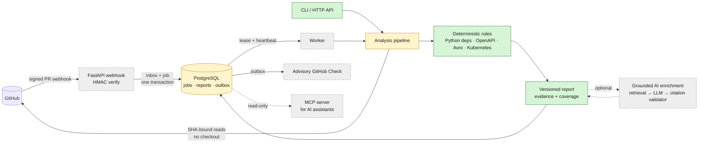

# ChangeGuard AI

[](https://github.com/belimm01/changeguard-ai/actions/workflows/ci.yml)
[](LICENSE)

ChangeGuard AI is an advisory pull-request change-impact analyzer. It reports
evidence-backed risks and recommendations; a human remains responsible for the
merge decision.

## v1 product boundary

ChangeGuard v1 is advisory and may be wrong. It reads GitHub pull-request
metadata, file paths, patches, repository file content, PR comments, and issue
text, then runs deterministic checks and may later add cited recommendations.
Its output is advice for a human reviewer, not a claim that a change is safe
or ready to merge.

V1 does not auto-merge, auto-approve, or auto-block pull requests, and it does
not execute repository code. Unsupported input formats and incomplete data are
reported as `partial` or `unsupported`, never as `safe`. The complete boundary
decision and threat controls are documented in
[`docs/adr/0001-system-boundary.md`](docs/adr/0001-system-boundary.md) and
[`docs/threat-model.md`](docs/threat-model.md).

## Architecture



Green: implemented. Yellow: in progress. Grey: planned. The GitHub reader,
SHA-bound content fetch and all four rules exist and are tested individually;
the CLI currently runs the Python dependency rule, and end-to-end wiring of the
full pipeline is in progress.

The domain core is framework-free. Rules are pure functions over immutable
value objects, and Pydantic validates every untrusted payload at the adapter
edge. Analysis reads only the exact base/head SHAs through the GitHub API and
never checks out or runs repository code. Missing or unsupported input is
reported as coverage, not hidden.

## Tech stack

- **Language and quality:** Python 3.13, `mypy --strict`, Ruff, pytest, `uv`
  with a locked dependency graph.
- **Service:** FastAPI, Pydantic v2, async `httpx` with timeouts, pagination
  caps and retry policy.
- **Persistence (in progress):** PostgreSQL, async SQLAlchemy 2.0 (`asyncpg`);
  Alembic migrations next.
- **Parsing:** safe, bounded YAML/JSON parsing for OpenAPI, Avro and Kubernetes.
- **Planned AI layer:** provider-neutral structured-output LLM adapter, lexical
  retrieval (embeddings optional), deterministic citation validation, offline
  evaluation and adversarial suites, an MCP server and DeepEval tool-use
  evaluation.
- **Planned delivery:** GitHub App authentication, a webhook inbox, a
  lease-based worker, a transactional outbox to GitHub Checks, privacy-safe
  telemetry, containers and CI security gates.

## Architecture decisions

| ADR | Decision | Status |
| --- | --- | --- |
| [0001](docs/adr/0001-system-boundary.md) | Advisory-only system boundary; untrusted inputs are data | Accepted |
| [0002](docs/adr/0002-layered-architecture.md) | Framework-free domain, validation at the boundaries | Accepted |
| [0003](docs/adr/0003-sha-bound-content-without-checkout.md) | SHA-bound content via GitHub API, never check out code | Accepted |
| [0004](docs/adr/0004-postgresql-jobs-inbox-outbox.md) | PostgreSQL for jobs, inbox and outbox instead of a broker | Accepted |
| [0005](docs/adr/0005-optional-grounded-ai.md) | Optional, provider-neutral AI with citation validation | Accepted |
| [0006](docs/adr/0006-read-only-mcp-server.md) | Read-only MCP server for AI assistants | Proposed |

Security controls are tracked in the [threat model](docs/threat-model.md).

## Roadmap

Work is planned as 37 dependency-ordered tickets across six milestones, each
with a contract, acceptance criteria and exit evidence.
[Full board](docs/ROADMAP.md) · [machine-readable backlog](docs/backlog.json)

| Milestone | Scope | Status |
| --- | --- | --- |
| Foundation | Domain model, first rule, GitHub payload adapter, rule orchestration | Done |
| Local vertical slice | JSON-in/JSON-out CLI with defined exit codes | Done |
| Evidence-backed analysis | Versioned reports, async GitHub reader, SHA-bound content, OpenAPI/Avro/Kubernetes rules, authenticated API, persistence | Persistence in progress |
| Grounded AI | Context corpus, retrieval, LLM adapter, citation validation, evaluation, adversarial tests | Planned |
| GitHub delivery | GitHub App auth, webhook inbox, durable worker, idempotent Checks | Planned |
| Release | Telemetry, container deployment, CI gates, sandbox acceptance run | Planned |
| Post-v1 extensions | Semantic retrieval, LLM cost observability, SSE streaming, guardrails, MCP server and evaluation | Planned |

## Development

Requires Python 3.13 and [uv](https://docs.astral.sh/uv/). Every change passes these
gates before it is merged:

```bash
uv run pytest -q
uv run ruff check .
uv run ruff format --check .
uv run mypy src tests
uv lock --check
```

PostgreSQL integration tests are skipped unless a database is reachable. Start a
disposable one with:

```bash
docker run -d --rm --name changeguard-pg -p 55432:5432 \
  -e POSTGRES_USER=cg -e POSTGRES_PASSWORD=cg -e POSTGRES_DB=changeguard postgres:16
```

or point `CHANGEGUARD_TEST_DB_URL` at another disposable instance.

Work is planned as small tickets with explicit acceptance criteria and merged to
`main` one tested increment at a time. Design, scope and review decisions are my
own; AI coding assistants are used as pair programmers and reviewers, and the
commits they contributed to carry a `Co-Authored-By` trailer.

## Local JSON analysis

Run the analyzer with a GitHub-shaped JSON document supplied on standard input:

```bash
uv run python -m changeguard < changed-files.json
```

Example input:

```json
[
  {
    "filename": "pyproject.toml",
    "status": "modified",
    "additions": 3,
    "deletions": 2,
    "patch": null
  }
]
```

The command writes one JSON array to standard output. A successful analysis
returns exit code `0`, whether findings are present or not. Malformed JSON,
invalid changed-file data, and input read or decoding failures leave standard
output empty, write a short diagnostic to standard error, and return exit code
`2`. The `--help` option displays usage, and unknown arguments are rejected.

## License

[MIT](LICENSE)
